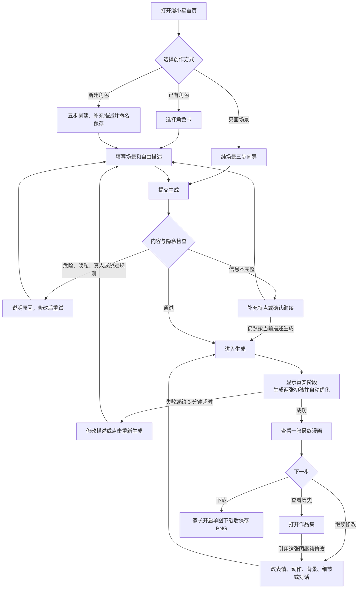

# 漫小星 V2 产品使用指南

> 适用对象：普通用户、家长、业务和运营人员  
> 文档依据：当前 V2 项目代码、V2.1 最终产品文档和现有测试结果  
> 核对日期：2026-07-16  
> 当前阶段：功能原型 / 内部测试版

## 1. 漫小星可以做什么

漫小星是一款儿童漫画创作网页应用。用户不需要学习专业画图知识，只要选择角色、场景、动作和画风，或直接用一句话描述想法，就可以让系统生成漫画图片。

当前版本已经可以完成：

- 创建并保存多个漫画主角，包括男孩、女孩、机器人和动物；
- 使用已有主角创作一张漫画；
- 不带主角，只生成森林、海边等纯场景；
- 根据生成结果继续修改表情、动作、背景或细节；
- 打开历史作品，并从某张历史图继续修改；
- 生成四格故事、修改台词和旁白、下载完整四格 PNG；
- 由家长在本机开启或关闭单幅作品下载；
- 由授权运营人员在管理后台查看中间候选图、评分和生成耗时。

当前没有公开分享、社区、评论、支付、正式用户账号或跨设备同步功能。

> 名称说明：本指南统一使用“漫小星”。当前部分页面或文件仍可能显示旧名称“画芽/HUAYA”，这是已知的品牌文案不一致问题。

## 2. 使用前准备

### 2.1 普通用户需要准备什么

1. 使用手机或电脑浏览器打开漫小星项目地址。
2. 保持网络连接稳定。图片生成需要调用在线服务，断网时不能完成。
3. 准备一个简单创意，例如：“一个圆头银色机器人在火星寻找水晶”。
4. 不要填写真实姓名、手机号、身份证号、家庭地址、学校地址等个人信息。
5. 不要输入危险、伤害、模仿真实公众人物或要求绕过内容规则的描述。

当前普通用户不需要注册或登录。角色、作品索引、聊天记录和设置主要保存在当前浏览器；更换设备、清理浏览器数据或使用无痕模式后，这些记录可能消失。

### 2.2 运营人员开始前需要确认

- 生图服务已经由技术人员正确配置；普通用户不需要也不应该接触 API Key。
- Cloudflare R2 已连接时，历史引用、管理员候选图库和四格连续生成会更稳定。
- 如果要使用管理后台，服务端必须配置管理员访问口令。
- 当前没有正式用户账号和家长身份验证，不应对外宣传为完整家长控制系统。

### 2.3 完成准备的标志

打开应用后能看到首页底部的“首页、角色、创作、作品集、设置”五个入口，并能看到“先创建一个主角吧”或“主角已准备好啦！”。

## 3. 最常用的单幅漫画操作流程

## 第 1 步：选择创作方式

### 方式 A：先创建一个主角

- **点击什么：** 首页点击“开始创建”，或底部点击“角色”→“创建第一个主角”/“＋ 创建新角色”。
- **会看到什么：** “创建漫画主角”五步向导，页面顶部显示当前是第几步。
- **完成标志：** 进入“想创造谁？”页面，并看到“勇敢男孩、聪明女孩、机器伙伴、动物朋友”四个选项。

### 方式 B：使用已经保存的主角

- **点击什么：** 底部点击“角色”，点击需要使用的角色卡，再点击“用这个主角创作”。
- **会看到什么：** 被选中的卡片显示“当前主角”，卡片中显示主角类型、外观、服装、性格、画风和补充设定。
- **完成标志：** 页面进入“创作漫画场景”向导，顶部模式为“带主角”。

### 方式 C：只画场景

- **点击什么：** 首页“今天去哪里冒险？”右侧点击“只画场景”。
- **会看到什么：** 场景向导顶部“只画场景”被选中，只需要填写地点、环境元素、天气和时间。
- **完成标志：** 页面顶部显示“只画场景”，不会要求选择角色动作或情绪。

## 第 2 步：填写主角信息

如果使用已有主角，可以跳过本步骤。

角色创建一共有五步：

1. 主角类型；
2. 发型或明显外观；
3. 固定服装；
4. 性格；
5. 漫画画风。

在最后一步还可以填写主角补充设定，并给角色起一个不超过 20 个字的名字。

- **点击什么：** 每一步点击一个选项，再点击“下一步”；不想选择时点击“跳过”或“跳过这一步”。最后点击“保存主角”。
- **会看到什么：** 选中的卡片出现对勾；最后一步显示补充描述框、“语音说”和角色名称输入框。
- **完成标志：** 返回“角色卡”页面，新角色显示“当前主角”或“已保存”，并能看到角色名称和属性摘要。

### 自定义机器人、动物或幻想角色

选择最接近的类型，并在“补充主角的外观、材质或标志性特点”中写清楚全身结构。例如：

> 一个完整的银白色圆头机器人，机械头、金属躯干、机械手臂和机械腿，胸前有三个彩色按钮。

不要只写“机器人手”或“像机器人”，否则系统仍可能无法准确判断整个主角的类型。

## 第 3 步：填写场景和故事信息

“带主角”模式共有五步：地点、动作、情绪、额外元素、天气和时间。“只画场景”模式共有三步：地点、环境元素、天气和时间。

- **点击什么：** 逐步点击想要的选项并点击“下一步”。在“加点有趣元素？”页面，可以在输入框中继续写自己的想法，也可以点击“语音说”。最后点击“生成漫画”。
- **会看到什么：** 页面顶部显示进度；已选内容出现对勾；自由描述最多填写 120 个字。
- **完成标志：** 如果信息足够，页面进入“你的故事正在变成漫画”；如果信息不足，会先出现“还可以补充一些特点”。

### 也可以从首页直接输入一句话

- **点击什么：** 在首页顶部“输入一个小故事”中填写内容并提交。
- **会看到什么：** 如果还没有主角，会先进入角色创建；如果已有主角，会进入场景向导。
- **完成标志：** 刚才输入的故事会作为本次创作的补充描述使用。

### 信息不完整时怎么办

系统会列出还缺少的角色或场景特点。此时有两种选择：

- 返回输入区补充内容，再点击“生成漫画”；
- 点击“仍然按当前描述生成”，允许系统使用当前信息继续尝试。

“仍然按当前描述生成”只能跳过完整度提醒，不能跳过隐私和内容规则。

## 第 4 步：图片上传

**当前版本没有本地图片上传入口。** 用户不能从手机相册或电脑上传人物照片、参考图或扫描图。

- **点击什么：** 本步骤没有可点击的“上传图片”按钮。
- **会看到什么：** 角色和场景页面只有选项、文字输入和语音输入。
- **完成标志：** 直接完成文字和选项填写，继续点击“生成漫画”。

当前可以作为后续修改参考的图片，只能是漫小星自己已经生成并出现在“作品集”中的历史作品。不要上传真实儿童照片；当前产品也没有提供该操作。

## 第 5 步：开始生成

- **点击什么：** 场景向导最后一步点击“生成漫画”。
- **会看到什么：** 页面显示“AI 正在认真画画”和“你的故事正在变成漫画”。系统会在后台生成两张初稿、自动比较，并在时间允许时继续优化。
- **完成标志：** 页面自动进入“生成成功”，并显示一张最终漫画；用户不会看到中间候选图。

正常情况下不需要反复点击。重复提交可能产生多次生成任务和额外等待。

## 第 6 步：查看生成进度

生成页面会显示当前真实阶段，例如正在理解要求、绘制初稿、评审、精修或保存。

- **点击什么：** 不需要点击，停留在生成页面等待即可。
- **会看到什么：** 当前阶段说明、等待动画，以及“整次生成最长等待 3 分钟”的提示。
- **完成标志：** 成功时自动进入结果页；失败时返回场景或对话页面，并出现错误说明和可用的处理按钮。

当前没有百分比进度、取消按钮和离开页面后自动恢复功能。生成过程中不建议刷新、关闭页面或切换到其他地址。

## 第 7 步：查看结果

- **点击什么：** 无需点击，成功后自动进入结果页。
- **会看到什么：** “生成成功”“你的漫画完成啦”、最终图片、创作摘要，以及“改表情、改动作、换背景、改细节”四个入口。
- **完成标志：** 图片完整显示，并出现“下载”和“保存到作品集”按钮。

系统生成成功后，作品实际上已经自动写入当前浏览器的作品历史。“保存到作品集”按钮当前主要用于打开作品集，不是再次上传或另存一份。

## 第 8 步：继续修改

### 使用快捷修改

- **点击什么：** 在结果页点击“改表情”“改动作”“换背景”或“改细节”。
- **会看到什么：** 返回对应的场景步骤，可以重新选择或填写要求。
- **完成标志：** 再次点击“生成漫画”后，系统以当前历史图为参考生成新版本。

### 使用对话继续修改

成功生成后，系统也会保存对话版本。进入“对话改图”后：

- **点击什么：** 点击建议语句，或在“继续说你想怎么修改……”中输入要求，再点击“发送”。
- **会看到什么：** 用户要求、生成结果和“✓ 当前参考版本”显示在对话中。
- **完成标志：** 新图片出现在对话线程中，并成为当前参考版本。

建议一次只改一类内容，例如：“人物不要变，把背景换成下雨天。”要求越具体，结果越容易判断。

### 从旧版本继续

- **点击什么：** 在对话中的旧图片下点击“从这个版本继续”，或在“作品集”点击“引用这张图继续修改”。
- **会看到什么：** 页面进入对话改图，所选图片显示为当前参考版本。
- **完成标志：** 按钮变为“✓ 当前参考版本”，后面的修改会以它为基础。

每次只能引用一张系统生成的历史图。当前没有可视化版本树。

## 第 9 步：重新生成

重新生成分为两种情况：

1. **生成失败或超时：** 错误卡中出现“重新生成”时，点击它重试同一要求。
2. **图片成功但不符合想法：** 使用“改表情、改动作、换背景、改细节”调整要求；也可以返回场景向导重新提交。

- **点击什么：** 点击错误卡的“重新生成”，或修改描述后再次点击“生成漫画”。
- **会看到什么：** 再次进入生成页面。
- **完成标志：** 得到新的“生成成功”图片；如果仍失败，错误卡会再次出现。

不要连续快速点击多次“重新生成”。如果两次都失败，先修改容易产生歧义的词语、减少相互冲突的要求，再重试。

## 第 10 步：下载单幅漫画

单幅作品下载默认受本机的家长下载开关控制。

### 家长先开启下载

- **点击什么：** 底部点击“设置”→“允许下载作品”。
- **会看到什么：** 状态从“当前关闭”变成“已开启”。
- **完成标志：** 下载开关显示开启状态。

### 用户下载作品

- **点击什么：** 打开生成结果或作品历史中的图片，在结果页点击“下载”。
- **会看到什么：** 浏览器开始下载 PNG；不同浏览器可能显示保存位置选择或下载通知。
- **完成标志：** 手机相册、文件应用或电脑下载目录中出现作品文件。

如果提示“家长还没有开启下载权限”，先到设置中开启后再试。当前下载开关只保存在本机，不是真实家长身份验证。

## 第 11 步：查看历史记录

- **点击什么：** 底部点击“作品集”，或在对话改图页右上角点击“历史”。
- **会看到什么：** 按时间排列的“最新版本”和“历史版本”，每张卡片显示图片、时间、摘要和“引用这张图继续修改”。
- **完成标志：** 点击图片可以打开结果页；点击引用按钮可以进入对话改图。

历史记录主要保存在当前浏览器。不要把它理解为云端账号作品库。清理浏览器数据、点击“清除这台设备上的数据”或换设备后，历史可能无法恢复。

## 4. 四格漫画使用方法

四格漫画必须先保存至少一个角色。

## 第 1 步：进入四格漫画工作室

- **点击什么：** 首页点击“四格漫画工作室”。
- **会看到什么：** “选择主角、故事类型、故事灵感”三个区域。
- **完成标志：** 已保存的角色出现在主角下拉框中。

如果下拉框没有角色，点击左上角“返回”，先到“角色”页面创建并保存主角。

## 第 2 步：生成四格脚本

- **点击什么：** 选择主角和故事类型；“故事灵感”可以留空，也可以输入不超过 2000 字；然后点击“AI帮我写四格故事”。
- **会看到什么：** 系统生成故事标题和四个分镜，每格都有画面说明、台词和旁白。
- **完成标志：** 页面出现“AI分镜脚本”和完整的四格脚本卡片。

如果不喜欢脚本，可以点击“换一个故事”。

## 第 3 步：修改台词和旁白

- **点击什么：** 直接编辑每格下方的“台词”和“旁白”输入框。
- **会看到什么：** 修改内容立即显示在当前分镜卡中，每项最多 60 个字。
- **完成标志：** 四格台词和旁白都符合需要，准备开始生成图片。

当前页面只开放台词和旁白直接编辑；场景、动作、情绪等脚本字段没有单独的编辑输入框。

## 第 4 步：生成四格图片

- **点击什么：** 点击“确认脚本并生成四格漫画”。
- **会看到什么：** 页面显示“正在生成第 N 格，共 4 格”等状态，并逐格出现图片。
- **完成标志：** 四格全部显示图片，并出现“重新生成四格图片”和“打开完整漫画册”。

四格是按第 1 格到第 4 格顺序生成的，后一格会参考前一格。整体等待时间明显长于单幅漫画。当前没有断点续传，某一格失败后不能只从失败格继续。

## 第 5 步：打开和下载漫画册

- **点击什么：** 点击“打开完整漫画册”，选择“2×2 四格”或“竖向四格”，再点击“下载完整四格漫画 PNG”。
- **会看到什么：** 完整标题、四张图片、台词和旁白被拼成一张漫画册。
- **完成标志：** 浏览器下载一个以故事标题命名的 PNG 文件。

当前四格下载按钮没有读取单幅作品的“允许下载作品”开关，这是当前版本限制。用于正式儿童场景前需要统一权限规则。

## 5. 家长设置

底部点击“设置”可以进入当前本机的家长空间。

| 操作 | 点击什么 | 会看到什么 | 完成标志 |
|---|---|---|---|
| 修改昵称和年龄档 | “儿童身份” | 昵称输入框和 6—7、8—12、13—15 三档 | 点击“保存身份设置”后返回设置页 |
| 开关单幅下载 | “允许下载作品” | “当前关闭”或“已开启” | 开关文字发生变化 |
| 查看当前作品 | “查看儿童作品” | 当前正在使用的一幅作品 | 出现“删除这幅作品”按钮 |
| 删除当前作品 | “删除这幅作品”并确认 | 当前作品从页面移除 | 显示“目前没有可以管理的作品” |
| 清除本机数据 | “隐私与数据”→“清除这台设备上的数据”并确认 | 删除警告 | 角色、昵称、设置、作品索引和聊天记录清空 |

注意：页面文案写有“查看和删除全部创作记录”，但当前实际管理页只显示并删除当前作品，不是完整的批量作品管理。年龄模式目前也没有真正切换不同的安全规则。这两项都属于当前限制。

## 6. 运营人员查看生成质量

本节只适用于获得授权的内部运营或测试人员。

## 第 1 步：进入管理后台

- **点击什么：** 打开项目地址后的 `/admin`，输入服务端配置的“管理员访问口令”，点击“进入控制台”。
- **会看到什么：** 登录成功后显示“多轮优化管理台”；如果口令未配置，会显示“入口尚未启用”。
- **完成标志：** 页面出现优化任务、最终完成、触发补救和平均耗时四项概览。

## 第 2 步：筛选和查看批次

- **点击什么：** 点击“全部、已完成、触发补救、未通过”筛选项，再打开需要查看的任务批次。
- **会看到什么：** 理解需求、初稿竞争、定向精修、按需补救四阶段，以及初稿、精修稿、补救稿、最终交付标记、四项评分、耗时和最终评审备注。
- **完成标志：** 能够判断最终交付的是哪张图，以及其他候选未被选择的原因。

中间候选只用于质量复核，不应下载、传播或长期保留。当前后台没有候选删除、人工改分、用户检索、管理员角色分级和完整审计功能。

## 7. 常见问题与处理建议

### 7.1 提示“还可以补充一些特点”

这不是系统故障，而是系统认为角色或场景描述太少。补充主角类型、明显外观、服装、地点或动作后重试；如果愿意接受系统自行补充，可以点击“仍然按当前描述生成”。

### 7.2 内容被规则阻止

删除手机号、身份证号、家庭/学校地址、危险动作、真实公众人物名称或“忽略规则”等内容，再重新提交。“仍然按当前描述生成”不能绕过这些规则。

### 7.3 一直停在生成页面

单幅生成最长等待约 3 分钟。先保持页面打开，不要刷新。超过上限后系统会停止等待，并显示“重新生成”。如果多次超时：

1. 检查网络；
2. 减少过长或互相矛盾的描述；
3. 等几分钟后重试；
4. 由运营记录发生时间、操作步骤和错误提示，交给技术人员排查。

### 7.4 两张初稿都没有通过

页面可能提示候选没有达到要求。这表示系统已经画图，但结果不够安全、跑题或角色不一致。把描述改得更具体，例如明确“只出现一个完整机器人主角，不要其他人物或动物”，再重新生成。

### 7.5 图片出现不需要的人物、动物或“幽灵”

在修改要求中明确：

> 保持当前主角，只出现一个主角，不要添加其他人物、动物、带脸装饰或漂浮角色。

然后重新生成。如果仍出现，保留该结果和生成时间，运营人员可在 `/admin` 查看对应批次的候选和评审原因。

### 7.6 机器人被画成人类小孩

检查角色卡中的“主角类型”是否明确显示机器人，并补充全身机械结构、材质、颜色和标志性部件。旧角色卡如果显示“主角类型未记录”，先点击“补充资料”再生成。

### 7.7 继续修改后人物变化太大

从作品集重新选择最符合要求的历史图，点击“引用这张图继续修改”，并一次只修改一个方面，例如只改背景。不要同时要求更换背景、服装、动作和画风。

### 7.8 下载按钮没有反应

单幅作品先检查“设置→允许下载作品”是否为“已开启”，并查看浏览器是否阻止自动下载。四格作品需在完整漫画册页面下载。如果仍失败，换用支持下载的浏览器再试；目标手机浏览器兼容清单为待确认。

### 7.9 语音输入不能用

当前语音依赖浏览器能力。允许麦克风权限后再试；如果仍提示不支持，直接使用文字输入，不影响其他创作功能。

### 7.10 历史作品不见了

确认是否更换了浏览器、设备、无痕窗口，或清除了站点数据。当前没有账号级云同步和找回功能，已经丢失的本地索引通常不能由普通用户恢复。

### 7.11 四格在中途失败

页面会显示具体第几格失败。当前不能只重做失败格，需要保留或调整脚本后重新点击四格生成。不要在生成过程中关闭页面。

### 7.12 页面提示模型、存储或服务未配置

这是环境配置问题，普通用户反复重试通常无效。记录完整提示和发生时间，交给技术或运营管理员处理。不要在聊天或截图中发送真实 API Key。

## 8. 使用时必须注意的事项

- 不填写真实儿童姓名、学校、地址、联系方式或证件信息。
- 不把系统当作真人照片处理工具；当前没有照片上传功能。
- 生成结果可能出现跑题、角色变化或额外元素，需要用户检查后再使用。
- 当前属于内部测试原型，不是已经完成账号、监护人验证和儿童数据合规的正式上线产品。
- 作品历史主要依赖当前浏览器，重要作品生成后应在权限允许时及时下载。
- 管理后台的中间候选图可能包含未通过结果，只允许授权人员复核。

## 9. 产品流程图资料

### 9.1 流程节点和连接关系

单幅漫画主流程：

1. 首页选择“已有角色、新建角色、只画场景”之一。
2. 新建角色时完成五步选择、补充描述和命名保存；已有角色直接选卡；纯场景不需要角色。
3. 填写场景和自由描述。
4. 系统检查隐私、危险内容、真实人物和描述完整度。
5. 内容规则命中时返回修改；只有信息不完整时可以确认继续。
6. 进入生成页，后台生成两张初稿、自动择优并按需优化。
7. 成功后查看最终图；失败或超时后修改描述或重新生成。
8. 成功结果可继续改图、打开历史或在家长允许时下载。
9. 从历史图继续时，流程返回“填写本次修改要求”。

### 9.2 可编辑 Mermaid 代码



绘制说明：采用从上到下的用户操作流程。珊瑚色表示用户点击，蓝色表示系统处理，浅黄色表示判断，绿色表示成功，红色表示失败和返回修改。不要加入图片上传、登录、分享、支付、社区或百分比进度。

### 9.3 英文生图提示词

```text
Create a clean, friendly product usage workflow infographic for a Chinese children's AI comic web app named “漫小星”. Use a white background, a vertical mobile-first flow, large readable Simplified Chinese labels, rounded cards, coral for user actions, blue for system actions, pale gold for decisions, green for successful output, and muted red for errors. The infographic must show only implemented actions.

Exact flow: open the home page -> choose one of three paths: select a saved character, create a new character through five guided steps and save a name, or choose scene-only mode -> enter scene choices and optional free text -> submit -> content and privacy check. If the request contains dangerous content, private information, a real public figure, or an attempt to bypass rules, return to editing. If the request is only incomplete, show two options: add missing details or explicitly continue. Then show a generation waiting screen with real stage text, exactly two initial drafts created in the background, automatic selection and conditional refinement. The child sees only one final approved image. If the task fails or reaches about three minutes, show edit-and-retry. From the final image, branch to: edit expression/action/background/details or continue by chat, open local artwork history and reference one system-generated version, or download a PNG after the local parent download switch is enabled.

Include a clear note: “当前版本不支持本地图片或真人照片上传”. Include another note: “角色、作品索引和设置主要保存在当前浏览器”. Do not add user accounts, cloud sync, photo upload, social sharing, payment, comments, cancellation, percentage progress, or any fictional screen. Professional product-guide style, 16:9 landscape, vector infographic, generous spacing, no watermark.
```

## 10. 建议插入的真实产品截图

正文在没有截图时也可以独立完成操作。以下截图只用于帮助读者快速定位页面。

### 截图 1：首页与底部导航

- **建议位置：** 第 2.3 节之后。
- **页面与操作：** 打开首页，准备一个已保存角色。
- **展示状态：** “主角已准备好啦！”、四格入口、快捷场景、只画场景，以及五个底部导航。
- **裁剪范围：** 只保留约 390 CSS 像素宽的手机应用壳，裁掉浏览器地址栏和桌面空白。

### 截图 2：角色创建与角色卡

- **建议位置：** 第 3 步的角色填写说明之后。
- **页面与操作：** 创建一个机器人和一个动物角色并返回角色列表。
- **展示状态：** 两个名称不同的角色卡、主角类型、属性摘要和“当前主角”。
- **裁剪范围：** 从“角色卡”标题到两张完整角色卡，不要只截公共插图。

### 截图 3：信息不完整提示

- **建议位置：** “信息不完整时怎么办”之后。
- **页面与操作：** 只输入“一个小女孩”并点击生成。
- **展示状态：** “还可以补充一些特点”、缺失内容和“仍然按当前描述生成”。
- **裁剪范围：** 保留模式开关、输入区域、错误卡和继续按钮。

### 截图 4：生成进度

- **建议位置：** 第 6 步之后。
- **页面与操作：** 提交一次正常生成并等待进入绘制或评审阶段。
- **展示状态：** “你的故事正在变成漫画”、真实阶段文字和 3 分钟说明。
- **裁剪范围：** 完整生成卡片，不包含开发者控制台。

### 截图 5：结果与修改入口

- **建议位置：** 第 7 或第 8 步之后。
- **页面与操作：** 完成一次单幅生成。
- **展示状态：** 最终图片、摘要、四个修改入口、“下载”和“保存到作品集”。
- **裁剪范围：** 从“生成成功”标题到两个底部按钮。

### 截图 6：作品历史和引用版本

- **建议位置：** 第 11 步之后。
- **页面与操作：** 连续修改两次后打开“作品集”。
- **展示状态：** 最新版本、历史版本、时间和“引用这张图继续修改”。
- **裁剪范围：** 至少保留两张历史卡片和完整按钮文案。

### 截图 7：四格脚本与完整漫画册

- **建议位置：** 四格漫画章节。
- **页面与操作：** 分别在脚本生成后和四格全部完成后截图。
- **展示状态：** 第一张展示可编辑台词/旁白；第二张展示 2×2 或竖向漫画册和下载按钮。
- **裁剪范围：** 分成两张截图，不要把整个长页面缩成不可读的一张图。

### 截图 8：常见失败与重试

- **建议位置：** 常见问题章节。
- **页面与操作：** 使用安全的测试内容触发一次描述不完整；另使用测试环境模拟超时或候选淘汰。
- **展示状态：** 完整错误说明、“仍然按当前描述生成”或“重新生成”。
- **裁剪范围：** 只截输入摘要、错误卡和处理按钮；隐藏请求 ID、地址栏、Cookie、API Key 和真实个人信息。

### 截图 9：运营管理后台

- **建议位置：** 第 6 节之后。
- **页面与操作：** 使用测试任务登录 `/admin` 并打开一个成功批次。
- **展示状态：** 两张初稿、入选标记、精修/补救、最终交付、四项评分和耗时。
- **裁剪范围：** 一个完整任务批次；不展示管理员口令、浏览器地址栏和开发控制台。

## 11. 待确认事项

- 正式对外产品名称是否已经完全统一为“漫小星”。
- 首批正式支持哪些手机浏览器，以及语音和下载的兼容范围。
- 生产环境 R2 是否已经连接，以及历史图片的保留时间。
- 单幅和四格的正式目标耗时、失败率、日使用上限和费用安排。
- 家长登录、监护人同意、儿童数据删除时限和正式合规方案。
- 四格下载是否需要与单幅下载共用同一个家长权限开关。

