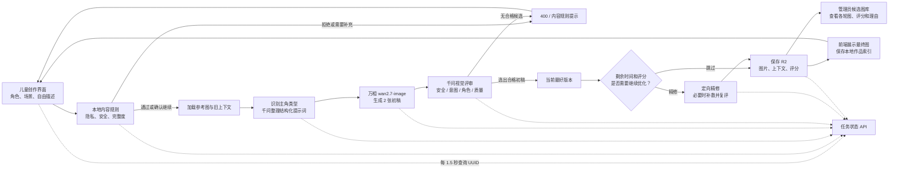

# 漫小星技术说明文档

> 文档性质：当前实现说明，不是未来架构设计稿  
> 核对日期：2026-07-16  
> 核对范围：当前工作区源代码、接口实现、自动测试、用户提供的测试结果与修改记录  
> 项目版本：`package.json` 标记为 `0.1.0`；工作区的 Git 历史当前无法正常读取，因此无法确认正式发布版本号和每项修改日期。

## 1. 文档结论摘要

漫小星当前是一套面向儿童的移动端漫画创作 Web 应用。儿童可以建立主角、描述场景、生成单幅漫画，也可以先由大语言模型规划四格故事，再逐格生成并在浏览器中拼成一张四格漫画。

当前真正运行的主生图链路是：前端提交创作要求，服务端先进行内容规则检查，再用千问视觉模型整理提示词，用万相 `wan2.7-image` 一次生成两张初稿，再由千问视觉模型评审。系统选择合格初稿后，在剩余时间允许时进行定向精修；质量仍偏低且时间充足时可再补救一次。用户只看到最终结果，管理员可以查看已经存入 R2 的候选图、各轮评分和选择理由。

需要特别说明：

- 当前作品、角色和家长设置主要保存在浏览器 `localStorage` 中，不是正式账号数据库。
- Cloudflare R2 已真实用于生成图片、生成上下文和任务状态保存。
- Cloudflare D1 表结构已经建立，但当前页面和接口没有调用 `getDb()`，因此数据库账号、儿童档案、作品版本等功能属于“已预留、尚未接入”。
- 构建和 22 项自动测试通过，但完整 ESLint 检查仍有 5 个错误和 8 个警告。
- 项目主名称已改为“漫小星”，但 manifest、README 和管理员页还残留“画芽/HUAYA”等旧名称。

## 2. 项目结构

### 2.1 目录与职责

| 目录或文件 | 当前真实作用 | 状态 |
|---|---|---|
| `app/page.tsx`、`app/creator-app.tsx` | 单幅漫画主应用；包含首页、角色、场景、生成中、结果、对话修改、作品和家长设置等视图 | 已使用 |
| `app/four-comic/` | 四格漫画工作室；生成四格脚本、逐格生图、浏览器拼图和下载 | 已使用 |
| `app/admin/` | 管理员登录与候选图库；查看 R2 中的生成批次、评分、理由和耗时 | 已使用 |
| `app/api/generate/` | 单幅生图与改图主接口，以及任务状态查询接口 | 已使用 |
| `app/api/four-comic/plan/` | 四格漫画脚本规划接口 | 已使用 |
| `app/api/images/` | 从私有 R2 读取并返回生成图片 | 已使用 |
| `app/api/admin/session/` | 管理员会话登录和退出 | 已使用 |
| `lib/generation.ts` | 内容检查、角色类型识别、提示词整理、千问/万相调用、候选评审和精修提示词 | 已使用，核心文件 |
| `lib/generation-timeout.ts` | 全流程截止时间、单阶段超时、取消和重试 | 已使用 |
| `lib/admin-auth.ts` | 管理员口令哈希、Cookie 会话验证 | 已使用 |
| `db/schema.ts`、`db/index.ts` | D1 表结构与数据库连接入口 | 已预留，业务尚未接入 |
| `drizzle/` | D1 数据表迁移文件 | 已生成，实际部署状态待确认 |
| `worker/index.ts` | Cloudflare Worker 入口和静态资源/图片优化绑定 | 已配置，生产部署状态待确认 |
| `vite.config.ts` | Vinext、Vite、Cloudflare 本地绑定与构建配置 | 已使用 |
| `tests/` | 内容规则、提示词、非人类主角、超时和凭据隔离测试 | 已使用 |
| `lib/context-mode.ts`、`lib/context-creation-view.tsx` | 早期上下文创作原型 | 当前没有被主应用导入，不属于真实主流程 |

### 2.2 主要技术组件

| 技术 | 通俗说明 | 当前用途 |
|---|---|---|
| React 19 + Next.js 16 | 页面和交互框架 | 构建移动端创作界面和 API 路由 |
| Vinext + Vite | 将 Next 风格应用构建到 Vite/Cloudflare 运行环境 | 本地开发、构建和启动 |
| Cloudflare Workers | 服务端运行环境 | 承载页面、接口和绑定资源 |
| Cloudflare R2 | 对象存储，可理解为私有文件仓库 | 保存图片、上下文 JSON、任务状态 JSON |
| Cloudflare D1 + Drizzle | SQLite 风格云数据库和数据访问工具 | 表结构已准备，业务尚未使用 |
| Tailwind CSS 4 | 页面样式工具 | 项目依赖；主界面也大量使用项目自定义 CSS 类 |
| Web Speech API | 浏览器自带语音识别能力 | 创作描述语音输入；兼容性取决于浏览器 |
| Canvas API | 浏览器画布 | 把四张分镜图片和文字拼成可下载的四格作品 |

运行要求以 `package.json` 为准：Node.js `>=22.13.0`，包管理器声明为 pnpm 11.12.0。

## 3. 主要页面和真实功能

### 3.1 单幅漫画主应用 `/`

`app/creator-app.tsx` 在一个移动端外壳中切换多个内部视图，而不是每一步都使用独立网址。

| 视图 | 用户可以做什么 | 数据去向 |
|---|---|---|
| 首页 | 进入角色创建、快速选场景、只画场景、四格漫画、作品或家长空间 | 仅导航 |
| 角色卡 | 查看已保存主角、切换当前主角、删除或继续用该角色创作 | 浏览器 localStorage |
| 角色创建 | 选择男孩、女孩、机器人、动物等类型，填写发型、服装、性格、画风和补充描述 | 浏览器 localStorage |
| 场景创建 | 选择地点、动作、情绪、天气，填写自由描述；选择“带主角”或“只画场景” | 提交到 `/api/generate` |
| 生成中 | 显示服务端真实阶段，轮询任务状态；失败或超时后允许重试 | 读取 `/api/generate/status/{id}` |
| 结果与对话修改 | 查看最终图，用自然语言继续改图，或引用历史版本继续修改 | 再次调用 `/api/generate` |
| 我的作品 | 查看本浏览器保存的作品和版本 | 浏览器 localStorage；图片来自 R2 或临时地址 |
| 家长空间 | 修改昵称、年龄显示档、下载开关、清除本地数据 | 浏览器 localStorage |

“家长空间”目前不是正式的家长账号系统。它没有手机号登录、短信验证、服务端身份绑定或不可绕过的权限控制；下载开关也只是保存在浏览器本地。

### 3.2 四格漫画 `/four-comic`

真实流程如下：

1. 用户选择已保存主角、故事类型并填写故事想法。
2. `/api/four-comic/plan` 使用千问生成标题和恰好四个分镜脚本。
3. 用户可以修改每格的画面、对白和旁白。
4. 前端按顺序调用四次 `/api/generate`。
5. 从第二格开始，把上一格的 R2 `referenceKey` 作为参考图，尽量保持角色一致。
6. 四格全部完成后，浏览器 Canvas 把图片和文字拼版成一张 PNG，并允许下载。

该流程不是一次后端长任务，也没有单独的四格总进度接口。任意一格失败都会中断后续生成，用户需要重试。

### 3.3 管理员页 `/admin`

管理员输入由环境变量 `ADMIN_ACCESS_TOKEN` 配置的口令后，获得最长 8 小时的 HttpOnly Cookie 会话。页面读取 R2 中 `generated/` 前缀下的对象，按 `batchId` 归为一次生成批次，并展示：

- 初稿、精修和补救轮次；
- 系统选择的候选图与最终图；
- 安全、意图符合度、角色一致性和画面质量四项评分；
- 评审理由、各轮耗时和总耗时；
- 是否触发补救，以及完成、补救或失败筛选。

管理员页当前最多读取 1000 个图片对象，没有分页。完全没有保存出任何图片的失败任务不会出现在候选图库中，因为该页面不读取 `jobs/` 状态目录。

## 4. 模型、真实接口与配置

### 4.1 使用的模型

| 模型 | 代码中的真实配置 | 作用 |
|---|---|---|
| 千问视觉模型 | 默认 `qwen3-vl-plus`；可由 `BAILIAN_VISION_MODEL` 修改 | 理解用户要求、结合参考图整理结构化提示词、评审候选图片；四格脚本规划也复用该模型 |
| 万相生图模型 | 代码固定为 `wan2.7-image` | 生成两张初稿、定向精修图和可选补救图 |

千问通过 DashScope 的 OpenAI 兼容接口调用；万相通过 DashScope 多模态生成接口调用。两者都使用服务端环境变量 `DASHSCOPE_API_KEY`，可选 `DASHSCOPE_WORKSPACE_ID`。

### 4.2 本项目 API

| 方法与地址 | 主要输入 | 成功输出 | 常见错误 |
|---|---|---|---|
| `POST /api/generate` | 角色、场景、自由描述、构图模式、参考图 key、修改意图、最近对话、任务 UUID | 最终图片 URL、R2 referenceKey、评审、各轮过程与上下文 | 400 输入格式；422 内容规则或候选淘汰；503 模型/R2 未配置；504 超时；502 上游失败 |
| `GET /api/generate/status/{id}` | 合法 UUID | 当前阶段、提示文字、是否完成/失败 | 400 UUID 非法；404 状态尚未建立；503 R2 未配置；502 状态文件损坏 |
| `GET /api/images/{id}` | 图片文件 ID | PNG 图片 | 404 ID 非法或不存在；503 R2 未配置 |
| `POST /api/four-comic/plan` | 故事想法、类型、角色描述 | 标题和 4 个分镜 | 400 缺少输入；422 内容规则；503 模型未配置；502 上游或 JSON 解析失败 |
| `POST /api/admin/session` | 管理员口令 | 204，并设置 Cookie | 400 请求格式；401 口令错误；503 管理员口令未配置 |
| `DELETE /api/admin/session` | 无 | 清除管理员 Cookie | 无专门业务错误 |

### 4.3 外部模型接口

| 外部接口 | 请求特点 | 当前超时策略 |
|---|---|---|
| DashScope OpenAI 兼容 Chat Completions | 文本或“参考图 + 文本”；要求千问返回 JSON | 主生成中纳入分阶段共享截止时间；四格脚本单次 60 秒 |
| DashScope Multimodal Generation | `wan2.7-image`、1536×2048、每次最多 2 张、关闭模型水印 | 初稿阶段单次预算 60 秒；精修 35 秒；补救 30 秒，并受总截止时间限制 |

实际账号配额、并发限制、单次价格、地域和生产可用性不在代码中，均为待确认。

## 5. 数据流转

### 5.1 普通单幅创作

1. 前端收集当前角色、场景选择、自由描述、构图模式和最近对话。
2. 前端生成 UUID 作为 `jobId`，提交 `POST /api/generate`。
3. 前端每 1.5 秒查询一次 `GET /api/generate/status/{jobId}`，显示“理解需求、绘制初稿、评审、精修、保存”等真实阶段。
4. 服务端先做本地内容规则和隐私检查；不合格时直接返回，不调用生图模型。
5. 如果是改图，服务端从 R2 读取旧图和对应上下文。
6. 千问把零散输入整理为结构化视觉要求，并明确本次允许改变和必须锁定的字段。
7. 万相生成两张初稿。
8. 千问视觉评审两张图，服务端按阈值选择合格候选。
9. 时间足够时对选中初稿定向精修；质量仍偏低且还有预算时再补救一次。
10. 服务端把每轮图片和完整上下文写入 R2，并返回最终图片。
11. 前端把作品索引、聊天和版本记录写入当前浏览器 localStorage。

### 5.2 浏览器、R2 与 D1 的分工

| 存储位置 | 当前保存内容 | 是否跨设备 |
|---|---|---|
| 浏览器 localStorage | 角色卡、当前角色、儿童昵称、年龄档、下载开关、作品索引、聊天记录、最近四格作品 | 否；清浏览器数据会丢失 |
| Cloudflare R2 `generated/` | 每一轮候选图片及评分元数据 | 是，但当前没有绑定到正式用户账号 |
| Cloudflare R2 `contexts/` | 结构化输入、改图锁定项、提示词整理结果、评审和流程信息 | 是 |
| Cloudflare R2 `jobs/` | 当前任务阶段 JSON | 是；每次更新会覆盖同一任务的上一个状态 |
| Cloudflare D1 | 仅有账号、儿童、角色、作品、版本、任务表结构 | 当前主流程未写入，不能视为已上线 |

R2 图片命名大致为：`generated/{batchId}-r1-1.png`、`r1-2.png`、`r2-1.png`、`r3-1.png`，分别对应两张初稿、精修图和补救图。并非每个任务都会生成到第三轮。

## 6. 提示词处理与角色类型识别

### 6.1 先检查，再优化

服务端不是直接把用户原话交给生图模型，而是按以下顺序处理：

1. 合并角色、场景和自由描述。
2. 检查长度、隐私信息、真实公众人物、危险内容和绕过规则的表达。
3. 判断描述是否明显缺少角色或场景信息。如果只是信息不完整，返回可继续的提示；用户点击“仍然按当前描述生成”后可继续，但安全规则不能绕过。
4. 从自由描述和角色卡推断主角属于人类、机器人、动物、幻想生物或未确定类型。
5. 对容易被上游内容检查误判、但本身可安全表达的服饰词进行中性视觉改写，例如把符号化身份词改成颜色、形状和服装细节。
6. 千问结合参考图、历史上下文和本次修改意图，输出结构化视觉规格。
7. 服务端再拼成万相所需的最终生图提示词。

### 6.2 非人类主角的处理

当前代码已经取消“信息不完整就默认补成人类儿童”的逻辑：

- 识别到机器人时，提示词要求机械结构覆盖头部、躯干和四肢；只有机械手而身体仍是人类不算符合要求。
- 识别到动物时，保持明确的动物头部和身体特征。
- 识别到幻想生物时，保持原设定的非人类结构。
- 无法识别时保持中性，不主动补成人类儿童。

候选评审也会收到预期主角类型。例如要求完整机器人却画成人类小孩、只增加机器手时，角色一致性和意图符合度应判为 0。

这套识别依赖关键词和模型理解，不能保证覆盖所有自造物种、错别字、方言或多语言表达。

### 6.3 新图与改图

新图只根据当前角色与场景生成。改图会额外读取：

- 上一版本图片；
- 上一版本的结构化上下文；
- 最近几轮用户对话；
- 本次修改属于背景、动作、情绪、服装等哪一类；
- 必须保持不变的字段和允许改变的字段。

因此改图不是简单重复上一条提示词。但如果旧图没有成功存入 R2，只返回了临时外部地址，则 `referenceKey` 为空，后续无法可靠引用旧图。

## 7. 生图、评审与精修流程

### 7.1 两张初稿与自动择优

万相第一轮固定请求两张 1536×2048 竖图。千问视觉模型为候选给出四项 0–100 分：

- `safety`：儿童安全；
- `intent`：是否符合用户要求；
- `character`：主角类型和设定是否一致；
- `quality`：构图、完整性和画面质量。

带主角模式下，候选进入下一步的最低门槛为：安全不低于 80、意图不低于 75、角色不低于 70。纯场景模式不使用角色分门槛。`quality` 当前没有作为初选硬门槛，但低于 78 会成为尝试精修或补救的依据。

额外人物、动物或幻想实体属于意图和画面质量问题，不应仅因为“多画了东西”就把安全分判为 0。真正危险、隐私或不适龄内容才属于安全失败。

### 7.2 精修与补救

- 有合格初稿且剩余时间足够时，系统以该图为参考进行一次定向精修。
- 精修后再次评审，与初稿比较并选择更合适者。
- 如果意图、质量、安全或角色分仍偏低，并且剩余时间至少满足补救预算，系统可再生成一张温和补救图并评审。
- 如果精修或补救超时，但已有安全合格初稿，系统保留初稿，不因后续优化失败而丢掉整个结果。

当前流程不是固定“必做 3–4 轮”。实际是“2 张初稿 + 条件精修 + 条件补救”，是否进入后两步由评分和剩余时间共同决定。

### 7.3 超时与重试

- 服务端整个 `/api/generate` 共享 175 秒截止时间。
- 前端在 180 秒主动停止等待，避免页面无限卡住。
- 提示词理解、初稿、评审、精修等关键阶段可以在预算允许时重试一次。
- 万相返回 `DataInspectionFailed`、内容或敏感检查失败时，会用更中性的严格提示词再试一次。
- 每个阶段都使用 `AbortController` 和超时竞争；即使某个操作忽略取消信号，接口也能在阶段预算用完后返回超时。

175/180 秒是代码中的控制值，不是模型服务 SLA。网络、模型排队和配额仍可能导致失败；重试也可能增加调用成本。

## 8. 技术流程图资料

### 8.1 节点、输入、输出和连接关系

| 节点 | 输入 | 输出 | 连接到 |
|---|---|---|---|
| A. 儿童创作界面 | 角色卡、场景、自由描述、构图模式、历史对话 | 生成请求与 UUID | B、M |
| B. 本地内容规则 | 合并后的文字 | 通过、可补充提醒或拒绝码 | C 或 E |
| C. 参考资料加载 | referenceKey | 旧图与旧上下文；无参考图时为空 | D |
| D. 主角识别与千问整理 | 当前输入、旧图、旧上下文 | 结构化视觉规格、锁定项、修改项 | F |
| E. 规则错误返回 | 错误码、提示、能否继续 | 422/400 等前端提示 | A |
| F. 万相两张初稿 | 最终生图提示词 | 两张候选图 | G |
| G. 千问视觉评审 | 两张图、预期主角、用户意图 | 四项评分、选择理由 | H 或 E |
| H. 合格初稿 | 评审通过的候选 | 当前最好版本 | I |
| I. 时间与质量判断 | 评分、剩余时间 | 跳过、精修或补救决定 | J 或 K |
| J. 定向精修/可选补救 | 当前最好图、评审问题 | 新候选和新评分 | K |
| K. R2 保存 | 各轮图片、上下文、评分、状态 | 图片 key、最终 URL、管理元数据 | L、N |
| L. 前端结果与历史 | 最终 URL、referenceKey | 作品、对话修改、四格下一格参考 | A |
| M. 状态轮询 | UUID | 当前阶段 | A |
| N. 管理员候选图库 | R2 图片元数据 | 批次、各轮图、评分、理由 | 管理员查看 |

连接关系：A→B→C→D→F→G；B 不通过时 B→E→A；G 无合格图时 G→E→A；G 合格后 G→H→I，I 可直接到 K，也可到 J→K；K→L→A；服务端各阶段同时写状态，M 持续把状态返回 A；K 中已保存的候选由 N 展示。

### 8.2 可编辑 Mermaid 代码



绘制说明：建议使用从左到右的主链，红色表示规则拒绝和失败回路，紫色表示千问文本/视觉节点，橙色表示万相图像节点，蓝色表示状态与存储，绿色表示最终输出。状态轮询使用虚线，图片与提示词的主数据流使用实线。

### 8.3 可直接使用的英文生图提示词

```text
Create a high-resolution professional technical workflow infographic for a Chinese children's AI comic product named “漫小星”. Use a clean white background, a wide 16:9 canvas, crisp vector-like shapes, readable Simplified Chinese labels, and a left-to-right architecture flow. Do not invent any components.

Show these exact layers and nodes:
1) User interface: child selects or describes a protagonist, scene, composition mode, and optional edit history; the browser creates a UUID.
2) Local content rules: privacy, real-person, unsafe-content, jailbreak, length, and missing-detail checks. A red branch returns a plain “内容规则提示”; incomplete safe input may continue after user confirmation.
3) Reference loader: load previous image and structured context from Cloudflare R2 only when a referenceKey exists.
4) Qwen vision model: infer protagonist kind (human, robot, animal, fantasy, or neutral), rewrite the request into a structured visual specification, and lock unchanged fields.
5) Wan 2.7 Image: generate exactly two 1536×2048 draft images.
6) Qwen visual review: score safety, intent match, character consistency, and image quality; reject the batch if no candidate qualifies.
7) Conditional optimization: choose the best safe draft, run one directed refinement when time remains, and optionally run one rescue image only when scores remain low and budget remains.
8) Cloudflare R2 storage: store round images, context JSON, evaluation metadata, and current job status.
9) Output: show the final image to the child, keep the local artwork index in browser localStorage, and allow later edits using referenceKey.
10) Admin: a protected admin candidate gallery reads saved R2 images and shows rounds, scores, reasons, and duration.

Add a dotted status-polling lane from the browser to the job status API, labeled “每 1.5 秒轮询”. Add a note: “服务端总截止 175 秒；前端等待 180 秒”. Use purple for Qwen nodes, orange for Wan image generation, blue for storage and status, green for successful output, and red for content-rule or failure branches. Include a small legend. Avoid code snippets, fake databases, phone login, payment, or unimplemented services. Make all Chinese text large and legible, with no decorative watermark.
```

## 9. 状态保存与恢复

### 9.1 任务状态

服务端把任务状态写为 `jobs/{jobId}.json`。前端按 UUID 轮询并显示当前阶段。该文件保存的是“当前快照”，不是完整事件日志；新阶段会覆盖旧阶段。生成接口最终成功或失败时也会更新状态。

### 9.2 作品与版本

单幅作品的索引和聊天版本保存在 localStorage。改图成功后，新版本会保留图片 URL、referenceKey、创建时间和对话内容，允许用户从历史结果继续修改。

数据库中虽然有 `artworks`、`artwork_versions` 和 `generation_jobs` 表，但当前代码没有把这些前端记录同步到 D1。换浏览器、清除站点数据或更换设备后，作品列表无法自动恢复；R2 中的图片仍可能存在，但用户界面没有账号级找回机制。

## 10. 错误处理

### 10.1 “内容规则”实际代表什么

界面可以统一显示“内容规则”，但接口内部仍保留具体错误码，便于技术排查：

| HTTP/错误码 | 含义 | 用户是否可继续 |
|---|---|---|
| 422 `CLARIFICATION_REQUIRED` | 描述太少，系统无法稳定确定角色或场景 | 可以；补充描述或确认按当前内容生成 |
| 422 `PRIVATE_INFO_REJECTED` | 检测到手机号、身份证、家庭/学校地址等隐私信息 | 不可以，需删除隐私内容 |
| 422 `REAL_PERSON_REJECTED` | 要求模仿真实公众人物或真实人物 | 不可以，需改成原创角色 |
| 422 `UNSAFE_CONTENT_REJECTED` | 危险、伤害或不适龄内容 | 不可以，需改成安全情节 |
| 422 `POLICY_BYPASS_REJECTED` | 要求忽略或绕过安全规则 | 不可以 |
| 422 `ALL_CANDIDATES_REJECTED` | 图已生成并评审，但两张都没达到安全/意图/角色门槛 | 可以重写描述后重试 |
| 400 | JSON、参考 key、修改意图或必需字段格式不合法 | 修正请求后重试 |
| 502 | 千问/万相上游错误、返回格式异常或读取失败 | 可以稍后重试；技术侧查请求 ID |
| 503 | API Key、管理员口令或 R2 绑定未配置 | 用户重试无效，需要管理员配置 |
| 504 `GENERATION_TIMEOUT` | 全流程或某阶段超过时间预算 | 可以重试 |

当前长度检查使用合并输入超过 2500 字符时拒绝，但用户提示文案仍提到 2000 字，二者不一致，需统一。

### 10.2 保存失败的降级

如果模型已经生成成功但 R2 保存失败，接口会尽量返回模型提供的临时图片 URL，让用户先看到结果；此时 `referenceKey` 为 `null`，管理员候选图库和后续可靠改图都可能缺失该作品。

## 11. API Key 与管理员安全

当前正确做法：

- `DASHSCOPE_API_KEY`、`DASHSCOPE_WORKSPACE_ID` 和 `ADMIN_ACCESS_TOKEN` 仅由服务端读取。
- `.env.example` 只有变量名和空值，没有真实密钥。
- `.gitignore` 忽略所有 `.env*` 文件，因此 `.env.local` 默认不会被提交。
- 自动测试检查前端源码中不包含 DashScope Key 名称和服务地址。
- 管理员 Cookie 使用 HttpOnly、SameSite=Strict，HTTPS 下增加 Secure，最长 8 小时。
- 管理员 Cookie 中保存的是带固定前缀的 SHA-256 结果，不直接保存原始口令。

仍需注意：

- 任何曾粘贴到聊天、截图、日志或公开仓库的真实 Key 都应在服务商控制台立即作废并重新生成；本文档不记录任何真实 Key。
- 当前是单个共享管理员口令，没有个人管理员账号、角色权限、登录失败限速、锁定或审计日志。
- 哈希比较是普通字符串比较，代码没有显式使用恒定时间比较。
- `/api/images/{id}` 和任务状态接口没有用户会话鉴权；图片 ID 和任务 UUID 难猜，但这不等同于正式访问控制。
- 没有发现接口级限流、并发配额或防重复提交锁。

## 12. 测试结果与测试后重要修改

### 12.1 本次实际执行结果

2026-07-16 在当前工作区执行 `pnpm test`：

- Vinext/Vite 构建成功；
- 发现并构建 `/`、`/four-comic`、`/admin` 和 5 组 API 路由；
- 自动测试 22 项全部通过，0 失败；
- 测试覆盖内容规则、隐私、真实人物、绕过规则、缺少信息可继续、自由描述识别、Wan 检查失败降级、改图上下文、纯场景、定向精修、额外实体评审、机器人/动物/未知主角、超时重试和 API Key 不进入前端。

同日执行 `pnpm lint`：5 个错误、8 个警告，未通过。主要问题是：

- `creator-app.tsx` 和 `four-comic/studio.tsx` 在 effect 内同步从 localStorage 初始化多个 React 状态；
- 四格页面使用普通 `<a>` 返回首页，Next 规则要求使用 `Link`；
- 未接入的上下文原型存在 effect、依赖和 `any` 类型问题；
- 主应用保留 3 个未使用旧组件；
- 字体在 layout 中通过外部 `<link>` 加载，触发 Next 警告。

### 12.2 根据测试结果已落实的修改

| 测试中发现的问题 | 当前代码中的处理 | 当前状态 |
|---|---|---|
| 必须点选预设才允许生成 | 完整度检查同时读取自由描述；安全信息不足时只提醒，用户可以确认继续 | 已实现 |
| 安全边界词被上游模型误判 | 对可安全表达的服饰/符号词做中性视觉改写；Wan 检查失败时严格提示词重试一次 | 已实现，但不能保证覆盖所有边界词 |
| 多张生图耗时过长 | 第一轮固定为两张初稿，不再一次生成四张 | 已实现 |
| 页面长时间停在“正在生成” | 增加真实阶段状态、175 秒服务端截止、180 秒前端截止、阶段超时和重试 | 已实现 |
| 后台看不到中间候选 | 增加 `/admin` 候选图库，显示各轮图片、评分、理由与耗时 | 已实现 |
| 合法主角被误判为“额外人物” | 评审明确主角是创作目标；额外实体只影响意图/质量，不自动等于安全失败 | 已实现 |
| 机器人被画成人类小孩或只换成机器手 | 增加主角类别推断、全身机器人约束和候选评审硬判定 | 已实现 |
| 信息不完整被默认成人类儿童 | 未识别类型保持中性，不自动补成人类儿童 | 已实现 |
| 精修失败导致整批失败 | 已有安全初稿时，精修/补救超时可回退到初稿 | 已实现 |

修改记录来自当前代码、测试名称和用户提供的测试记录。由于当前工作区 Git 历史无法读取，具体提交、作者和日期均为待确认。

## 13. 建议插入的真实截图

文档正文已经可以独立说明项目，截图只用于佐证，不用于代替文字。

### 截图 1：角色类型与自由描述

- 插入位置：第 3.1 节之后。
- 页面与操作：打开 `/`，进入角色创建，选择“机器人”或输入自定义非人类角色描述。
- 展示状态：角色类型、补充设定和“用这个角色创作”按钮同时可见。
- 裁剪范围：只保留手机应用框，从页面标题裁到提交按钮；不要包含浏览器地址、桌面和任何 Key。

### 截图 2：真实生成阶段

- 插入位置：第 7.3 节之后。
- 页面与操作：提交一次生成，在“生成中”页面等待服务端进入“绘制两张初稿”或“视觉评审”。
- 展示状态：真实阶段文案、等待动画和重试/超时提示区域。
- 裁剪范围：手机应用完整生成卡片；不要只截静态装饰图。

### 截图 3：管理员候选批次

- 插入位置：第 3.3 或第 7 节之后。
- 页面与操作：完成一次成功生图后登录 `/admin`，展开该批次。
- 展示状态：同一批次的 2/2 初稿、AI 已选标识、四项评分、评审理由、精修/补救状态和总耗时。
- 裁剪范围：一个完整批次；隐藏地址栏、管理员口令、请求头和开发控制台。

### 截图 4：F12 Network 的接口证据

- 插入位置：第 4.2 或第 10 节之后。
- 页面与操作：打开 F12 → Network，执行一次生成；分别选择 `POST /api/generate` 和一次 `GET /api/generate/status/{id}`。
- 展示状态：请求方法、状态码、响应中的 `stage`、`stageLabel`、`canRetry` 或最终结果字段。
- 裁剪范围：保留请求列表和 Response 面板；必须遮挡 Authorization、Cookie、完整 UUID、图片签名地址、API Key 和个人输入。

### 截图 5：本地状态与 R2 状态的区别

- 插入位置：第 5.2 或第 9 节之后。
- 页面与操作：F12 → Application → Local Storage，展示 `manhua-characters`、`manhua-artworks` 等键名；值只展示结构，不展示真实儿童信息。
- 展示状态：说明角色和作品索引确实在本地浏览器，而非 D1。
- 裁剪范围：键名列和经过脱敏的示例值；不展示完整图片地址、聊天内容或隐私数据。

## 14. 后续优化方向

以下是建议，不代表已经实现：

1. 正式接入 D1，把账号、儿童档案、角色、作品版本和生成任务与用户身份绑定，实现跨设备恢复。
2. 建立真实家长认证和权限系统；服务端强制下载、删除和数据查看权限，而不是只依赖 localStorage。
3. 为图片和状态接口增加用户级授权、短时签名 URL 或服务端会话校验。
4. 把生成任务改成持久化队列/状态机，支持断线恢复、幂等、取消和完整事件历史，避免长请求占用。
5. 为管理员图库增加分页、按任务查询、纯失败任务列表、人工复核结果和操作审计。
6. 用人工标注测试集校准四项阈值，单独统计机器人、动物、幻想生物、纯场景、改图和边界词成功率。
7. 增加 OCR/文字泄漏、额外实体、肢体完整性、角色一致性的专门检测，而不只依赖通用视觉评分。
8. 补充真实浏览器 E2E、真实模型沙箱、R2/D1 集成、并发、成本、弱网、移动浏览器和恢复测试。
9. 统一“漫小星”品牌、manifest、管理员页和 README；清理未使用的原型组件并修复 ESLint。
10. 建立 Key 轮换、配额告警、成本统计、请求审计、数据保留和儿童数据删除制度。

## 15. 已知问题与技术限制

1. **D1 尚未接入业务。** 数据表存在不等于数据库功能已上线；当前没有服务端用户、作品和版本持久化。
2. **本地数据不能跨设备恢复。** 清理浏览器数据会丢失角色、作品索引、聊天和家长设置。
3. **家长权限不是强权限。** 没有真实手机号/短信验证，下载开关可被本机用户修改。
4. **图片和状态缺少用户级鉴权。** 管理员页有登录，但图片读取和任务状态查询只依赖难猜 ID。
5. **管理员能力有限。** 单一共享口令、无账号权限、无失败限速、无审计、最多读取 1000 个图片对象、无分页。
6. **未保存图片的失败任务不进入管理员图库。** `jobs/` 状态也没有完整事件历史。
7. **R2 保存失败会影响后续改图。** 临时图可显示，但没有 referenceKey，无法可靠引用和审计。
8. **175/180 秒不是成功保证。** 上游排队、网络和额度都可能造成超时；重试会增加成本。
9. **四格漫画总耗时较长。** 四格按顺序调用四次完整生成流程，任意一格失败会中断，没有统一后台任务恢复。
10. **模型输出具有概率性。** 非人类主角、额外实体、角色一致性和提示词边界问题已加强，但无法完全消除幻觉。
11. **规则检测并非完整 DLP 或人工审核。** 隐私和危险内容主要依靠规则与模型，可能漏判或误判。
12. **评分阈值尚未经过正式统计验证。** 当前 80/75/70 等阈值来自产品规则，人工标注规模和准确率待确认；质量分不是初选硬门槛。
13. **缺少正式限流与幂等。** 相同 UUID 重复提交可能覆盖状态或同名 R2 对象；没有任务锁和去重机制。
14. **自动测试不等于真实服务验证。** 当前 22 项测试主要是单元/源码检查，没有自动调用真实千问、万相、生产 R2/D1，也没有浏览器 E2E。
15. **完整 ESLint 未通过。** 当前仍有 5 个错误和 8 个警告，需要在交付前修复。
16. **品牌和文案不一致。** layout 使用“漫小星”，manifest、README 和管理员页仍有“画芽/HUAYA”等旧名称。
17. **长度规则文案不一致。** 代码按 2500 字符判断，错误提示中写 2000 字。
18. **语音输入兼容性有限。** 依赖浏览器 Web Speech API，部分浏览器、权限或网络环境不可用。
19. **PWA 能力不完整。** 有 manifest 和 standalone 配置，但没有确认离线缓存、Service Worker 和完整图标配置。
20. **生产环境待确认。** D1/R2 的真实绑定、数据保留期限、删除机制、模型配额、成本预算、监控和报警没有在代码中得到完整确认。

## 16. 事实依据索引

| 说明主题 | 主要代码依据 |
|---|---|
| 页面与本地状态 | `app/creator-app.tsx`、`app/four-comic/studio.tsx` |
| 生图接口与两轮/补救流程 | `app/api/generate/route.ts` |
| 内容规则、提示词、模型和评审 | `lib/generation.ts` |
| 超时与重试 | `lib/generation-timeout.ts` |
| 状态查询 | `app/api/generate/status/[id]/route.ts` |
| R2 图片读取 | `app/api/images/[id]/route.ts` |
| 四格脚本 | `app/api/four-comic/plan/route.ts` |
| 管理员登录与图库 | `lib/admin-auth.ts`、`app/api/admin/session/route.ts`、`app/admin/page.tsx` |
| D1 预留结构 | `db/index.ts`、`db/schema.ts`、`drizzle/` |
| Cloudflare 绑定 | `.openai/hosting.json`、`vite.config.ts`、`worker/index.ts` |
| 环境变量安全 | `.env.example`、`.gitignore`、`tests/rendered-html.test.mjs` |
| 自动测试 | `tests/generation-guards.test.mjs`、`tests/generation-timeout.test.mjs`、`tests/rendered-html.test.mjs` |
